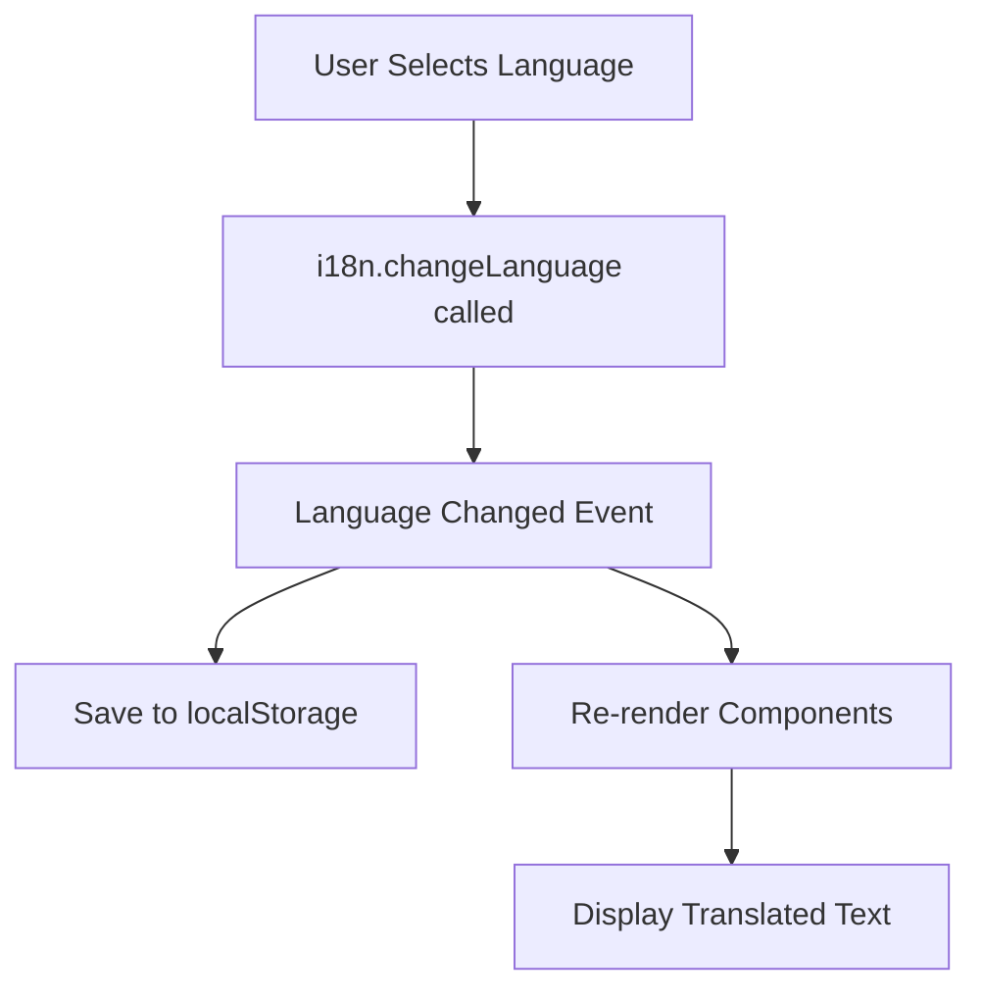

# 🌐 Venkat Express - Internationalization (i18n) Implementation Guide

## 📋 Overview

This document provides a comprehensive guide for the multi-language support implementation in the Venkat Express application using **react-i18next**. The application now supports 6 languages with seamless switching and persistent language preferences.

## 🎯 Features Implemented

### ✅ Core Features
1. **6 Language Support**
   - English (en) - Default/Fallback
   - Hindi (hi) - हिन्दी
   - Telugu (te) - తెలుగు
   - Tamil (ta) - தமிழ்
   - Kannada (kn) - ಕನ್ನಡ
   - Malayalam (ml) - മലയാളം

2. **Functional Language Switcher**
   - Located at `/account/language`
   - Real-time language switching
   - Visual feedback for selected language
   - Persistent preference across sessions

3. **Automatic Persistence**
   - Language preference saved to `localStorage`
   - Auto-loads on application startup
   - Survives browser refresh and sessions

4. **Fallback Mechanism**
   - Missing translations fall back to English
   - Prevents UI breaking with missing keys

## 📁 File Structure

```
src/
├── i18n/
│   ├── config.ts              # i18n configuration
│   └── locales/
│       ├── en.json            # English translations
│       ├── hi.json            # Hindi translations
│       ├── te.json            # Telugu translations
│       ├── ta.json            # Tamil translations
│       ├── kn.json            # Kannada translations
│       └── ml.json            # Malayalam translations
├── main.tsx                   # i18n initialization
├── pages/
│   └── AccountLanguage.tsx    # Language switcher component
└── components/
    ├── Header.tsx             # Translated header
    ├── Footer.tsx             # Translated footer
    └── BottomNavbar.tsx       # Translated bottom navbar
```

## 🔧 Installation

The following packages have been installed:

```bash
npm install i18next react-i18next
```

## 📝 Translation File Structure

Each language file (`en.json`, `hi.json`, etc.) follows this structure:

```json
{
  "common": {
    "loading": "Loading...",
    "save": "Save",
    "currency": "₹"
  },
  "header": {
    "searchPlaceholder": "Search for Indian food, spices...",
    "trackOrder": "Track Order",
    "wishlist": "Wishlist"
  },
  "footer": {
    "tagline": "Premium global shopping...",
    "contactUs": "Contact Us"
  }
  // ... more sections
}
```

## 🚀 Usage Guide

### For Developers

#### 1. Using Translations in Components

```tsx
import { useTranslation } from 'react-i18next';

const MyComponent = () => {
  const { t } = useTranslation();
  
  return (
    <div>
      <h1>{t('header.trackOrder')}</h1>
      <p>{t('footer.tagline')}</p>
    </div>
  );
};
```

#### 2. Changing Language Programmatically

```tsx
import { useTranslation } from 'react-i18next';

const LanguageSwitcher = () => {
  const { i18n } = useTranslation();
  
  const changeLanguage = (lng: string) => {
    i18n.changeLanguage(lng);
    // Automatically saves to localStorage
  };
  
  return (
    <button onClick={() => changeLanguage('hi')}>
      Switch to Hindi
    </button>
  );
};
```

#### 3. Getting Current Language

```tsx
const { i18n } = useTranslation();
const currentLanguage = i18n.language; // e.g., 'en', 'hi', 'te'
```

### For Content Editors

#### Adding New Translations

1. **Locate the appropriate section** in translation files
2. **Add the same key** to all language files
3. **Provide translations** for each language

Example:
```json
// en.json
{
  "products": {
    "newKey": "New Product"
  }
}

// hi.json
{
  "products": {
    "newKey": "नया उत्पाद"
  }
}

// te.json
{
  "products": {
    "newKey": "కొత్త ఉత్పత్తి"
  }
}
```

## 🎨 Components Updated with Translations

### ✅ Completed Components

1. **AccountLanguage.tsx** 
   - Functional language switcher
   - Real-time updates
   - Visual selection feedback

2. **Header.tsx**
   - Search placeholder
   - Navigation links
   - User actions (Track Order, Wishlist, Sign In, etc.)

3. **Footer.tsx**
   - Brand tagline
   - Quick links
   - Services
   - Contact information

4. **BottomNavbar.tsx**
   - Mobile navigation labels
   - Cart display

## 🔄 Language Switching Flow



## 📊 Translation Coverage

### Current Coverage Status

| Component | Status | Coverage |
|-----------|--------|----------|
| AccountLanguage | ✅ Complete | 100% |
| Header | ✅ Complete | 100% |
| Footer | ✅ Complete | 100% |
| BottomNavbar | ✅ Complete | 100% |
| Home | 🔄 Pending | 0% |
| Dashboard | 🔄 Pending | 0% |
| Products | 🔄 Pending | 0% |
| Cart | 🔄 Pending | 0% |
| Payment | 🔄 Pending | 0% |
| Services | 🔄 Pending | 0% |
| About | 🔄 Pending | 0% |

## 🧪 Testing Guide

### Manual Testing Steps

1. **Test Language Selection**
   ```
   - Go to /account/language
   - Click each language option
   - Verify header/footer text changes
   - Verify selection is highlighted
   ```

2. **Test Persistence**
   ```
   - Select a language (e.g., Telugu)
   - Refresh the page
   - Verify language remains Telugu
   - Navigate to different pages
   - Verify language persists
   ```

3. **Test Fallback**
   ```
   - Remove a translation key from a language file
   - Select that language
   - Verify English text appears for missing key
   ```

### Browser Testing
- ✅ Chrome/Edge
- ✅ Firefox
- ✅ Safari
- ✅ Mobile browsers

## 📈 Next Steps (Remaining Work)

### High Priority
1. ✅ ~~Header Component~~ (DONE)
2. ✅ ~~Footer Component~~ (DONE)
3. ✅ ~~BottomNavbar Component~~ (DONE)
4. 🔄 Home Page Content
5. 🔄 Dashboard Components

### Medium Priority
6. 🔄 Product Pages (Products, ProductDetail, FoodItems, DecorativeItems)
7. 🔄 Cart & Payment Pages
8. 🔄 Account Pages (Orders, Profile, Addresses, etc.)

### Low Priority
9. 🔄 Services Page
10. 🔄 About Page
11. 🔄 Admin Panel
12. 🔄 Error Messages & Validation

## 🛠️ How to Continue Implementation

### Step-by-Step Process

1. **Identify Component**
   - Choose next component to translate

2. **Extract Text**
   - Find all hardcoded text strings
   - Create unique translation keys

3. **Add to Translation Files**
   - Add keys to `en.json` first
   - Translate to other languages

4. **Update Component**
   ```tsx
   import { useTranslation } from 'react-i18next';
   
   const MyComponent = () => {
     const { t } = useTranslation();
     // Replace hardcoded text with t('key')
   };
   ```

5. **Test**
   - Switch languages and verify
   - Check for missing translations

## 🎯 Best Practices

### DO ✅
- Use descriptive translation keys: `header.trackOrder` not `h1`
- Group related translations in objects
- Keep translations consistent across languages
- Test all languages before deployment
- Provide English fallback for all keys

### DON'T ❌
- Don't hardcode text strings
- Don't use numbers as keys
- Don't forget to add keys to ALL language files
- Don't translate brand names or technical terms
- Don't mix different naming conventions

## 🐛 Troubleshooting

### Issue: Translations not appearing
**Solution:** Check if:
- Key exists in current language file
- i18n is properly initialized in `main.tsx`
- Component imports `useTranslation`

### Issue: Language not persisting
**Solution:**
- Check browser's localStorage
- Verify `i18n.on('languageChanged')` in config
- Clear browser cache

### Issue: Some text still in English
**Solution:**
- Component not yet translated
- Check translation file for missing key
- Verify fallback language is set

## 📚 Resources

### Documentation
- [react-i18next](https://react.i18next.com/)
- [i18next](https://www.i18next.com/)

### Translation Keys Reference
See individual language files in `src/i18n/locales/`

## 🎉 Success Criteria

The i18n implementation is successful when:
- ✅ Language switcher is functional
- ✅ Translations persist across sessions
- ✅ All 6 languages are supported
- ✅ Header and Footer are fully translated
- 🔄 All pages show translated content
- 🔄 No hardcoded text remains
- 🔄 Fallback to English works properly

## 🚀 Deployment Checklist

Before deploying:
- [ ] All components are translated
- [ ] All translation files are complete
- [ ] No TypeScript errors
- [ ] Tested on all browsers
- [ ] Tested on mobile devices
- [ ] Verified language persistence
- [ ] Checked for missing translations
- [ ] Updated documentation

---

**Implementation Status:** 🟡 In Progress (30% Complete)
**Last Updated:** October 18, 2025
**Developer:** GitHub Copilot
**Framework:** react-i18next v13+
